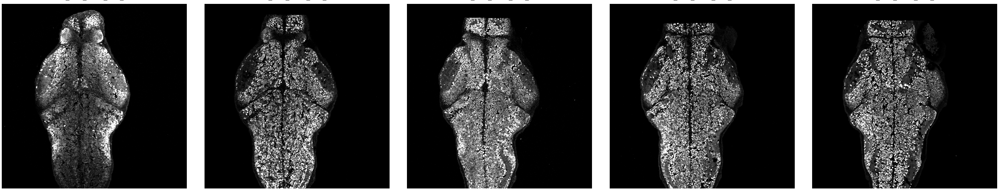

# Multimodal volumetric stack registration (Napari + ANTs)

This repository implements a pipeline for registering zebrafish two-photon (2P) functional calcium imaging volumes to immuno-DAPI stained OCT-embedded cryosection stacks.

---

## Overview of the workflow

**Input:** multi-channel 3D TIFF stacks from immunostained OCT-embedded cryosection (e.g. Olympus OIR converted to TIFF)

**Output:**
- registered NIfTI volumes (fixed ↔ moving)
- ImageJ-ready 2‑channel QC overlays
- timestamped JSON records capturing the *exact ANTs command used*

Pipeline steps:
1. **Pre-alignment (Napari, local)** — enforce consistent orientation across stacks.
2. **QC & annotation (Napari, local)** — mark damaged sections and select an optimal Z slice (`best_z`) per section.
3. **Montage construction (local)** — trim each stack around `best_z`, perform 2D rigid alignment, and concatenate into a reference volume.
4. **ANTs registration (SLURM)** — run multi-stage 3D registration (Rigid → Similarity → SyN) on the assembled montage.

---

## Repository contents

### `napari_pre-alignment.py`
Interactive Napari tool to quickly rotate and flip OCT sub-stacks along the rostro–caudal axis.

### `annotate_damaged_sections.py`
Interactive QC + annotation utility (Napari + PDF):

- **Step 1 (interactive, Napari)**:
  - open each pre-aligned sub-stack
  - annotate whether the stack is **damaged** or **good**
  - for good stacks, select the **best Z slice** (`best_z`) with the strongest signal
    (this slice is later used for montage alignment)

- **Step 2 (report)**:
  - generate a PDF QC report showing:
    - damaged stacks shaded in red
    - the longest consecutive run of non-damaged stacks outlined in yellow
    - thumbnails taken from the annotated `best_z` slice
      (fallback to the middle slice if not annotated)

Annotations are saved to **`section_annotations.tsv`**.
`damaged_stacks.txt` is automatically kept in sync for backwards compatibility.

### `montage_register_prealigned.py`
Builds a clean reference volume from multiple adjacent stacks:

- selects the **longest contiguous run of non-damaged sections**
  (based on `section_annotations.tsv` / `damaged_stacks.txt`)
- for each stack:
  - trims to a fixed Z-window around the annotated **`best_z`** slice
    (user-defined number of slices before and after)
- performs 2D rigid registration using the **annotated `best_z` slice**
  (registration channel configurable)
- applies the resulting 2D transform to **all Z slices and all channels**
  in the trimmed block
- concatenates all aligned blocks along Z to form the final montage


*Example output of the montage step, showing multiple adjacent sections rigidly aligned prior to ANTs registration.*

### `ANTs_register_without_mask.py`
Main registration driver based on **ANTs**:
- converts fixed and moving TIFF stacks to NIfTI with **explicit voxel spacing**
- runs a multi-stage ANTs pipeline:
  **Rigid → Similarity → SyN**
- writes:
  - canonical warped volumes
  - ImageJ-compatible 2‑channel overlays
  - **timestamped JSON files containing the full `antsRegistration` command** for reproducibility

---

## Typical usage

### 0) Convert raw data to TIFF

Raw imaging data (e.g. Olympus `.oir`) should be batch-converted to TIFF using **Fiji / ImageJ**:

1. `Process → Batch → Convert…`
2. Input: folder with `.oir`
3. Output format: `TIFF`

Bio-Formats preserves channels, Z-planes, and bit depth.

---

### 1) Pre-align stacks (Napari)

```bash
python napari_pre-alignment.py
```

Interactively rotate/flip stacks so all volumes share a consistent orientation before automated processing.

### 2) QC and damaged-section detection

```bash
# interactive annotation (Napari)
python3 annotate_damaged_sections.py annotate

# generate/update the PDF report from existing annotations
python3 annotate_damaged_sections.py report

# do both (annotate, then report)
python3 annotate_damaged_sections.py all
```

Creates/updates `section_annotations.tsv`, keeps `damaged_stacks.txt` in sync for backwards compatibility, and writes a PDF QC report.

### 3) Montage clean sections

```bash
python3 montage_register_prealigned.py
```

Builds a single, clean reference volume from the longest contiguous run of non-damaged stacks, trimming each sub-stack around the annotated `best_z` slice and using that slice for 2D rigid alignment.

### 4) Multimodal registration with ANTs (SLURM cluster)

```bash
sbatch slurm/run_ants_register.sbatch \
  --fixed  /path/to/fixed_montage.tif \
  --moving /path/to/moving_stack.tif
```

This step is computationally intensive and intended to run on the SLURM cluster. It performs full 3D registration and writes:
- warped NIfTI volumes
- ImageJ-compatible QC overlays
- timestamped JSON files capturing the exact `antsRegistration` command

---

## Running on a SLURM cluster

Only the ANTs registration step is intended to run on the SLURM cluster.

This repository includes SLURM helper scripts/templates (see the `slurm/` folder) to:
- activate the project environment on the cluster
- run 3D ANTs registration with appropriate CPU/RAM/time requests

The montage construction step is typically run locally, while the ANTs registration is submitted to the SLURM cluster.

Typical usage:
```bash
# run montage locally
python3 montage_register_prealigned.py

# submit ANTs registration to the cluster
sbatch slurm/run_ants_register.sbatch \
```

Adjust partition, account, walltime, and memory settings in the `.sbatch` files to match your cluster configuration.

---

## Environment

A Conda environment file is provided:

```bash
conda env create -f stx-py310.yaml
conda activate stx-py310
```

This installs ANTs dependencies, Napari, scientific Python libraries, and Bio-Formats support.

---</file>