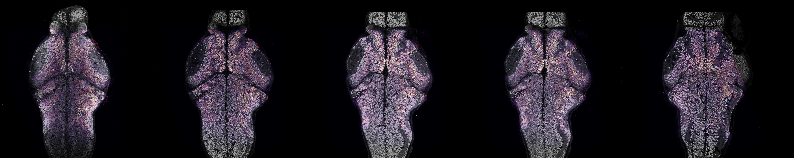

# Multimodal volumetric stack registration (Napari + BigStream)


*Example output of the montage step, showing multiple adjacent sections aligned prior to volumetric registration.*

---

## Overview of the workflow

**Input:** multi-channel 3D TIFF stacks from immunostained OCT-embedded cryosection (e.g. Olympus OIR converted to TIFF)

**Output:**
- registered NIfTI volumes (fixed ↔ moving)
- ImageJ-ready 2‑channel QC overlays
- timestamped JSON records capturing the exact parameters used

Pipeline steps:
1. **Pre-alignment (Napari, local)** — enforce consistent orientation across stacks.
2. **QC & annotation (Napari, local)** — mark damaged sections and select an optimal Z slice (best_z) per section.
3. **Volume registration (BigStream, local/cluster)** — apply global + piecewise transforms and export QC overlays + metadata.

---

## Repository contents

### `pre-processing/napari_pre-alignment.py`
Interactive Napari tool to quickly rotate and flip OCT sub-stacks along the rostro–caudal axis.

### `pre-processing/annotate_damaged_sections.py`
Interactive QC + annotation utility (Napari + PDF):

- **Step 1 (interactive, Napari)**:
  - open each pre-aligned sub-stack
  - annotate whether the stack is **damaged** or **good**
  - for good stacks, select the **best Z slice** (`best_z`) with the strongest signal
    (this slice is later used for montage alignment)

- **Step 2 (report)**:
  - generate a PDF QC report showing:
    - damaged stacks shaded in red
    - the longest consecutive run of non-damaged stacks outlined in yellow
    - thumbnails taken from the annotated `best_z` slice
      (fallback to the middle slice if not annotated)

Annotations are saved to **`section_annotations.tsv`**.
`damaged_stacks.txt` is automatically kept in sync for backwards compatibility.

### `pre-processing/montage_register_prealigned.py`
Builds a clean reference volume from multiple adjacent stacks:

- selects the **longest contiguous run of non-damaged sections** (from `section_annotations.tsv`)
- trims each stack to a fixed Z-window around **`best_z`**
- concatenates aligned blocks along Z to form the final montage

### `BigStream_register_*.py`
Registration drivers based on **BigStream**:
- run global + distributed piecewise alignment
- write ImageJ-compatible 2‑channel overlays
- write timestamped JSON configs (paths + parameters) for reproducibility

---

## Typical usage

### 0) Convert raw data to TIFF

Raw imaging data (e.g. Olympus `.oir`) should be batch-converted to TIFF using **Fiji / ImageJ**:

1. `Process → Batch → Convert…`
2. Input: folder with `.oir`
3. Output format: `TIFF`

Bio-Formats preserves channels, Z-planes, and bit depth.

---

### 1) Pre-align stacks (Napari)

```bash
python pre-processing/napari_pre-alignment.py
```

Interactively rotate/flip stacks so all volumes share a consistent orientation before automated processing.

### 2) QC and damaged-section detection

```bash
# interactive annotation (Napari)
python3 pre-processing/annotate_damaged_sections.py annotate

# generate/update the PDF report from existing annotations
python3 pre-processing/annotate_damaged_sections.py report

# do both (annotate, then report)
python3 pre-processing/annotate_damaged_sections.py all
```

Creates/updates `section_annotations.tsv`, keeps `damaged_stacks.txt` in sync for backwards compatibility, and writes a PDF QC report.

### 3) Montage clean sections

```bash
python3 pre-processing/montage_register_prealigned.py
```

Builds a single, clean reference volume from the longest contiguous run of non-damaged stacks, trimming each sub-stack around the annotated `best_z` slice and using that slice for 2D rigid alignment.

---

## References

- BigStream (Janelia SciComp): https://github.com/JaneliaSciComp/bigstream
- Marquez-Legorreta *et al.* (bioRxiv, 2026): *Whole-Brain Co-Mapping of Gene Expression and Neuronal Activity at Cellular Resolution in Behaving Zebrafish*. https://doi.org/10.64898/2026.02.07.704095

---

## Environment

A Conda environment file is provided:

```bash
conda env create -f stx-py310.yaml
conda activate stx-py310
```

---